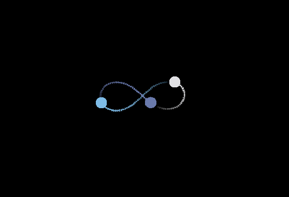

# 3-Body-Problem

This project models the three body problem along with other multiple body simulations using the velocity Verlet algorithm. This was part of a university assignment in python which I adapted and added some pretty stuff on top.

### Key Features
* Able to model $N$ body interactions of any masses.
* Assigns random colors to each body for variety.
* Leaves a trail behind the body to show where it's been.

### Some examples of this simulation
#### Sun-Earth-Moon Simulation
The classic sun earth moon simulation where a small body orbits around a larger body that orbits an even larger body. This is very stable due to the difference in masses between each body.

Positions:
```math
\begin{bmatrix}
0 & 0 \\
1 & 0 \\
1 +\frac{7}{45} & 0
\end{bmatrix}
```

Velocities:
```math
\begin{bmatrix}
0 & 0 \\
0 & 1 \\
0 & 1-\frac{7}{15}
\end{bmatrix}
```

Masses:
```math
\begin{bmatrix}
1 \\
0.0338765 \\
0.0001 
\end{bmatrix}
```
#### Note
The masses must be correct for each body otherwise the initial positions and velocities will be incorrect.
<br>


#### Figure-8 Simulation
The three body problem is infamous for being mathematically chaotic, but given certain conditions, there are a number of arrangements which result in a stable orbit of three bodies of similar masses. This is one of them, forming a figure 8 sign where each body cuts through the middle of the two outer bodies. 

Positions:
```math
\begin{bmatrix}
0.97000436 & -0.24308753 \\
-0.97000436 & 0.24308753 \\
0 & 0
\end{bmatrix}
```

Velocities:
```math
\begin{bmatrix}
0.466203685 & 0.43236573 \\
0.466203685 & 0.43236573 \\
-0.93240737 & -0.86473146
\end{bmatrix}
```

Masses:
```math
\begin{bmatrix}
1 \\
1 \\
1
\end{bmatrix}
```
<br>



